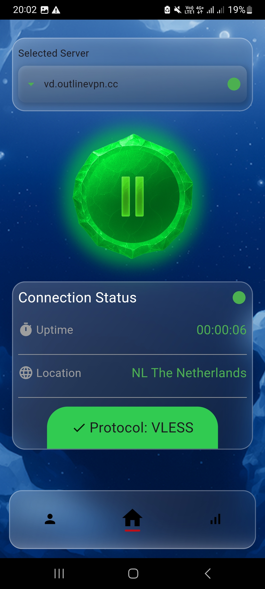
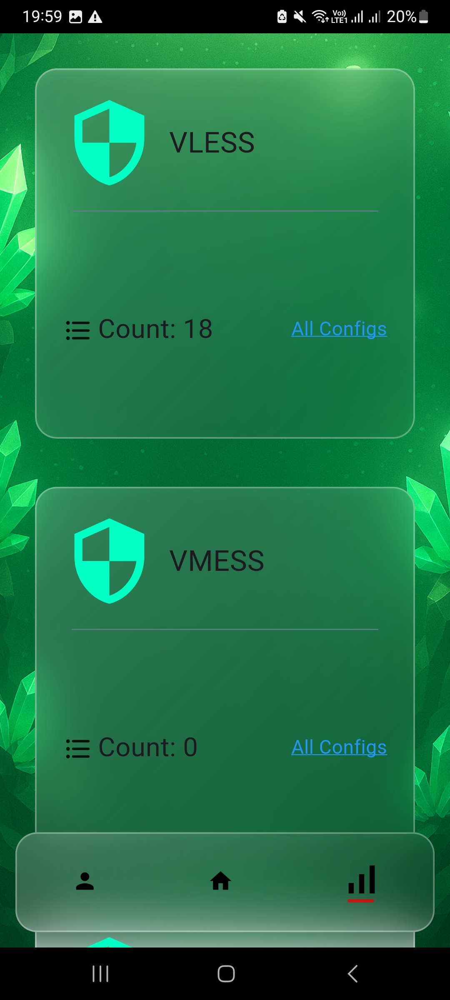
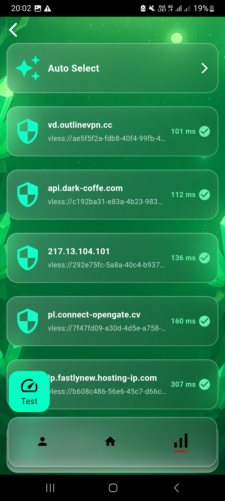
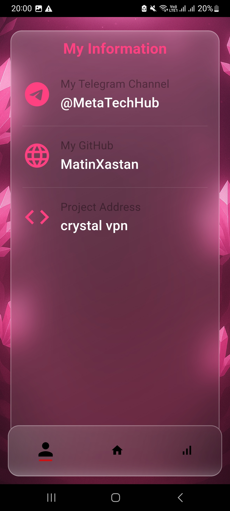

# 🛡️ Crystal VPN

[cite_start]یک برنامه VPN جامع و قدرتمند برای دسترسی امن و آزاد به اینترنت، با تمرکز بر پروتکل‌های V2Ray و مجموعه‌ای غنی از کانفیگ‌های تست‌شده[cite: 1, 6].
[cite_start]این پروژه با **Flutter** توسعه یافته و تجربه‌ای بومی و روان را ارائه می‌دهد[cite: 2, 8].
[cite_start]این اپ نه تنها یک کلاینت ساده برای اتصال به سرورها است، بلکه به‌عنوان یک **مجموعه‌دار کانفیگ‌های آماده** عمل می‌کند[cite: 3].
[cite_start]کاربران می‌توانند به‌راحتی بین پروتکل‌ها و تنظیمات مختلف جابه‌جا شوند و بهترین اتصال ممکن را انتخاب کنند[cite: 4].

## ✨ ویژگی‌های کلیدی

- [cite_start]**کانفیگ‌های متنوع VPN**: دسترسی به مجموعه‌ای از کانفیگ‌های از پیش تنظیم‌شده با پروتکل‌های مختلف (V2Ray، Shadowsocks و غیره)[cite: 5].
- [cite_start]**کلاینت V2Ray قدرتمند**: استفاده از هسته V2Ray برای اتصالات پایدار، امن و پرسرعت[cite: 6].
- [cite_start]**مدیریت آسان پروفایل‌ها**: انتخاب سریع کانفیگ‌ها با رابط کاربری intuitive[cite: 7].
- [cite_start]**رابط کاربری زیبا**: طراحی مدرن و کاربرپسند با Flutter، سازگار با اندروید[cite: 8].
- [cite_start]**نمایش وضعیت اتصال**: اطلاعات لحظه‌ای درباره سرعت، مصرف داده و وضعیت اتصال[cite: 9].

## 📸 تصاویر محیط برنامه

| صفحه اصلی | لیست سرورها | جزئیات پروتکل | پروفایل کاربری |
| :---: | :---: | :---: | :---: |
|  |  |  |  |

> *نکته: تصاویر محیط کاربری جهت آشنایی بیشتر با رابط کاربری مدرن اپلیکیشن قرار داده شده‌اند.*

## 🚀 شروع به کار

### پیش‌نیازها
- [cite_start]**Flutter SDK**: نسخه 3.0.0 یا بالاتر (توصیه‌شده: 3.24.x برای بهترین سازگاری)[cite: 10].
- [cite_start]**Android Studio** یا **VS Code** با پلاگین‌های Flutter و Dart[cite: 11].
- **JDK**: نسخه 17 یا بالاتر برای توسعه اندروید.
- [cite_start]یک دستگاه اندروید یا شبیه‌ساز متصل[cite: 12].

### نصب و اجرا
1. **کلون کردن مخزن**:
   ```bash
   git clone [https://github.com/MatinXastan/crystal-Vpn.git](https://github.com/MatinXastan/crystal-Vpn.git)
   cd crystal-Vpn
دریافت وابستگی‌ها:Bashflutter pub get
اجرای پروژه:Bashflutter run
(اطمینان حاصل کنید که دستگاه یا شبیه‌ساز اندروید متصل است.)نکات اضافیبرای ساخت APK، از flutter build apk --release استفاده کنید.📱 دانلود اپبرای دانلود نسخه‌های آماده، به صفحه Releases مراجعه کنید1:معماریلینک دانلودUniversal[] دانلودarm64-v8a[] دانلودarmeabi-v7a[] دانلودx86_64[] دانلود🙏 تقدیر و تشکربخش اصلی این پروژه، یعنی پیاده‌سازی کلاینت V2Ray، با الهام از پروژه flutter_v2ray_client نوشته‌شده توسط Amir-zr انجام شده است2.از زحمات ایشان در توسعه و اشتراک‌گذاری این ابزار ارزشمند صمیمانه سپاسگزاریم3.📄 مجوز (License)این پروژه تحت مجوز MIT منتشر شده است4.این مجوز به شما آزادی کامل برای استفاده، تغییر، توزیع و زیرمجموعه‌سازی کد می‌دهد5.برای جزئیات بیشتر، به فایل LICENSE مراجعه کنید6.⭐ اگر این پروژه مفید بود، با ستاره دادن حمایت کنید!🐛 باگ‌ها را در Issues گزارش دهید7.آخرین به‌روزرسانی: ژانویه ۲۰۲۶
---

### ⚠️ مرحله بسیار مهم (ارسال عکس‌ها)

چون در عکس ارسالی شما کنار فایل‌ها حرف **U** (به معنی Untracked) وجود دارد، یعنی این عکس‌ها هنوز به گیت معرفی نشده‌اند. اگر فقط فایل README را آپدیت کنید و پوش کنید، عکس‌ها در سایت گیت‌هاب نمایش داده **نمی‌شوند**.

حتماً دستورات زیر را در ترمینال VS Code اجرا کنید تا عکس‌ها هم آپلود شوند:

```bash
git add screenshots/
git add README.md
git commit -m "Add screenshots and update README"
git push